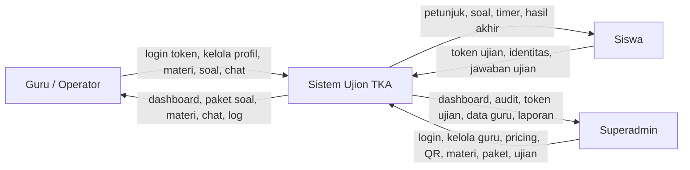
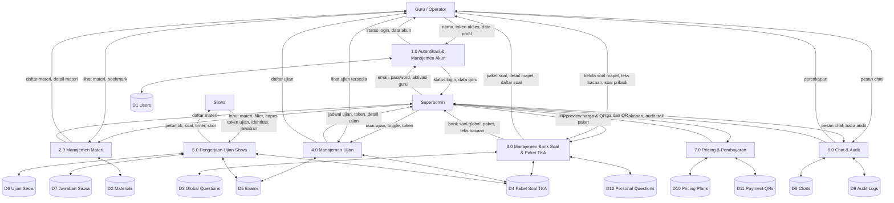
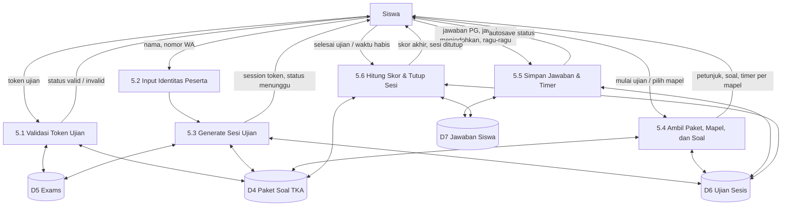
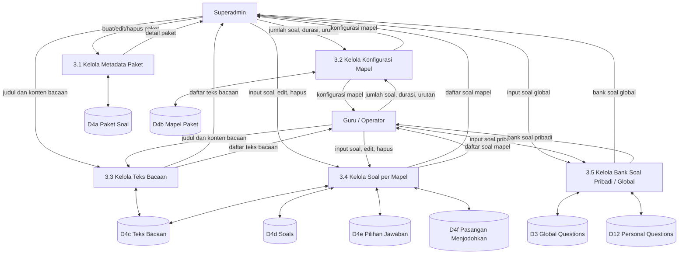

# DFD Ujion TKA

Dokumen ini merangkum Data Flow Diagram berdasarkan codebase saat ini. Karena sistem masih memiliki flow lama dan flow baru untuk modul ujian, DFD ini fokus pada flow yang paling nyata dipakai sekarang, lalu saya tambahkan catatan untuk flow legacy.

## 1. Context Diagram

## 2. DFD Level 1

## 3. DFD Level 2 - Pengerjaan Ujian Siswa

## 4. DFD Level 2 - Manajemen Paket Soal TKA

## 5. Catatan DFD

- DFD ini dibuat dari flow aplikasi yang saat ini paling nyata di codebase.
- Modul `questions`, `participants`, dan `participant_answers` masih ada sebagai flow legacy.
- Flow ujian siswa aktif sekarang terutama memakai:
  - `exams`
  - `paket_soals`
  - `mapel_pakets`
  - `soals`
  - `ujian_sesis`
  - `jawaban_siswas`
- Jika kamu mau, saya bisa lanjut pecah jadi:
  - `DFD-context.png`
  - `DFD-level1.png`
  - `DFD-level2-siswa.png`
  - `DFD-level2-paket.png`

