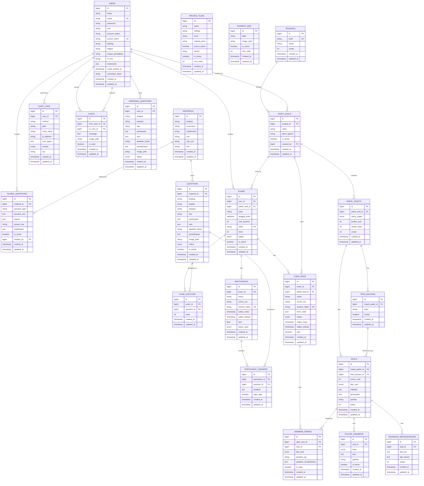

# ERD Ujion TKA

ERD ini dibuat dari migrasi yang ada di `database/migrations` pada 16 April 2026. Saya bagi menjadi 2 bagian:

- domain aplikasi
- tabel infrastruktur Laravel

Catatan penting:

- codebase ini masih memiliki 2 jalur domain ujian:
  - schema lama: `questions`, `participants`, `participant_answers`, `exam_question`
  - schema baru: `paket_soals`, `mapel_pakets`, `soals`, `ujian_sesis`, `jawaban_siswas`
- field `users.bookmarks` adalah JSON, bukan foreign key ke `materials`
- tabel `sessions` punya `user_id` yang di-index, tetapi di migrasi default ini tidak dideklarasikan sebagai foreign key

## 1. ERD Domain Aplikasi



## 2. ERD Infrastruktur Laravel

```mermaid
erDiagram
    PASSWORD_RESET_TOKENS {
        string email PK
        string token
        timestamp created_at
    }

    SESSIONS {
        string id PK
        bigint user_id IDX
        string ip_address
        text user_agent
        longtext payload
        int last_activity
    }

    CACHE {
        string key PK
        mediumtext value
        int expiration
    }

    CACHE_LOCKS {
        string key PK
        string owner
        int expiration
    }

    JOBS {
        bigint id PK
        string queue
        longtext payload
        int attempts
        int reserved_at
        int available_at
        int created_at
    }

    JOB_BATCHES {
        string id PK
        string name
        int total_jobs
        int pending_jobs
        int failed_jobs
        longtext failed_job_ids
        mediumtext options
        int cancelled_at
        int created_at
        int finished_at
    }

    FAILED_JOBS {
        bigint id PK
        string uuid UK
        text connection
        text queue
        longtext payload
        longtext exception
        timestamp failed_at
    }
```

## 3. Ringkasan Relasi Penting

### Relasi akun dan operasional

- `users` -> `audit_logs`
- `users` -> `chats` sebagai pengirim
- `users` -> `chats` sebagai penerima
- `users` -> `paket_soals` sebagai pembuat
- `users` -> `exams` sebagai pembuat
- `users` -> `personal_questions` sebagai pemilik
- `users` -> `global_questions` sebagai pembuat

### Relasi konten lama

- `materials` -> `questions`
- `questions` <-> `exams` lewat `exam_question`
- `exams` -> `participants` -> `participant_answers`

### Relasi konten baru TKA

- `jenjangs` -> `paket_soals`
- `paket_soals` -> `mapel_pakets`
- `mapel_pakets` -> `teks_bacaans`
- `mapel_pakets` -> `soals`
- `teks_bacaans` -> `soals`
- `soals` -> `pilihan_jawabans`
- `soals` -> `pasangan_menjodohkans`
- `exams` -> `ujian_sesis`
- `ujian_sesis` -> `jawaban_siswas`

## 4. Catatan Desain

- Schema baru TKA sudah lebih normal dan eksplisit untuk multi-mapel.
- Schema lama dan schema baru masih hidup bersamaan, jadi ERD ini sengaja menampilkan keduanya.
- Jika nanti kamu ingin, saya bisa lanjut bikin versi kedua:
  - `ERD-active-only.md` yang hanya berisi schema aktif produksi
  - atau `ERD.png` dari diagram ini dalam bentuk gambar

